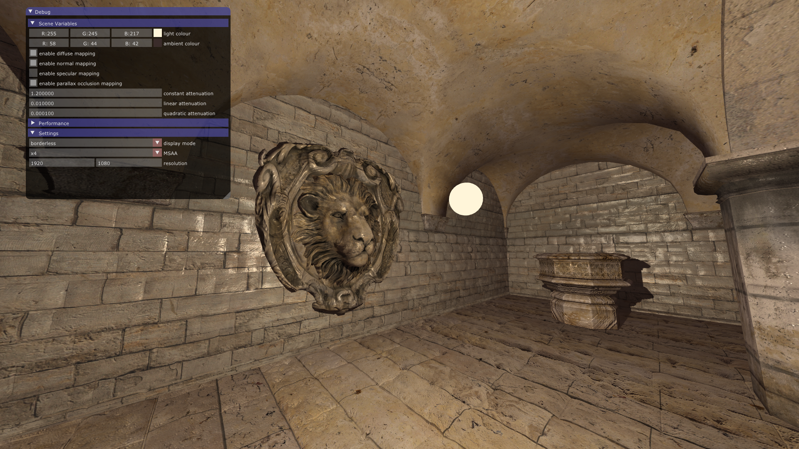
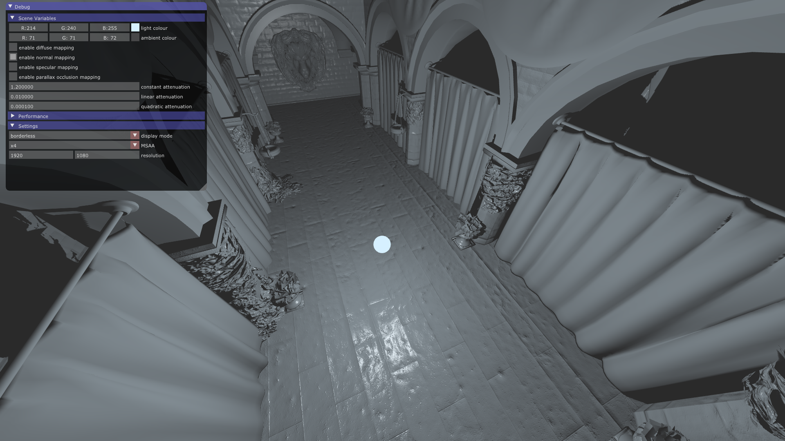
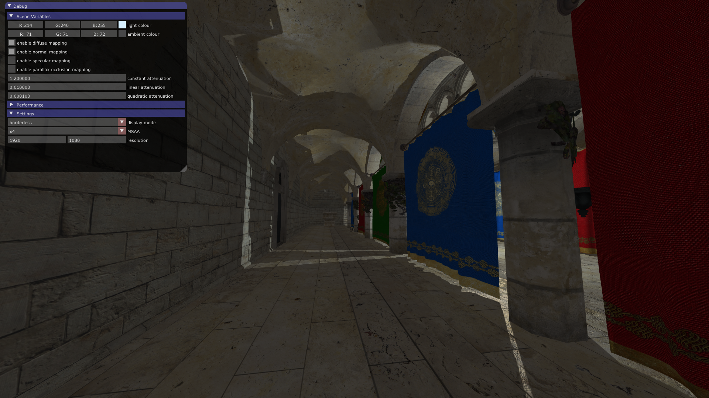

A simple forward renderer with a few different features:
- basic phong shading with normal maps
- specular maps (although they look strange)
- [parallax occlusion mapping](https://www.gamedev.net/articles/programming/graphics/a-closer-look-at-parallax-occlusion-mapping-r3262/)
- [omnidirectional](http://developer.download.nvidia.com/books/HTML/gpugems/gpugems_ch12.html) [variance](https://developer.nvidia.com/gpugems/GPUGems3/gpugems3_ch08.html) shadow mapping
- skybox

The original project was (partially) intended to be used for games at some point so there are some design decisions that reflect that. Such as a custom 3D model format and lots of configurable options.

The sample application uses crytek's sponza model although any model can be used when run through `modelbuild`.

This repository is forked from an older version of [this](https://github.com/BrotherhoodOfHam/TSEngine) because I did not want to throw away all of the work I had put into this version. The code is not great though, I was inexperienced when I started this.

